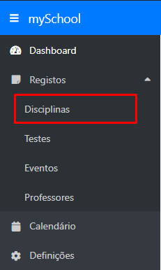

# Adicionar

## Adicionando uma disciplina

Primeiramente, inicie sessão na aplicação através da página de login, ou crie uma conta caso não seja utilizador do mySchool.

Após efetuar login ou criar uma conta, verá que foi redirecionado para a página inicial da aplicação, também chamada de dashboard.

Para aceder à secção de disciplinas, expanda o menu **Registos** no menu lateral e selecione a opção **Disciplinas**.

