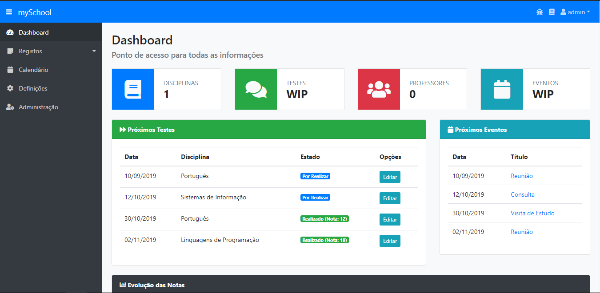

# Adicionar

## Adicionando uma disciplina

Primeiramente, inicie sessão na aplicação através da página de login, ou crie uma conta caso não seja utilizador do mySchool.

Após entrar no seu dashboard, selecione a secção **Registos** e a opção **Disciplinas**.

